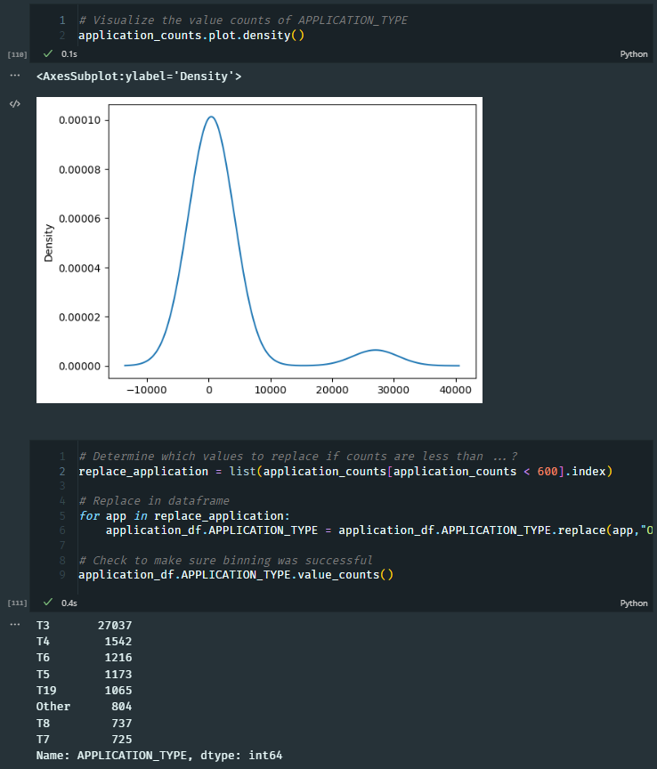
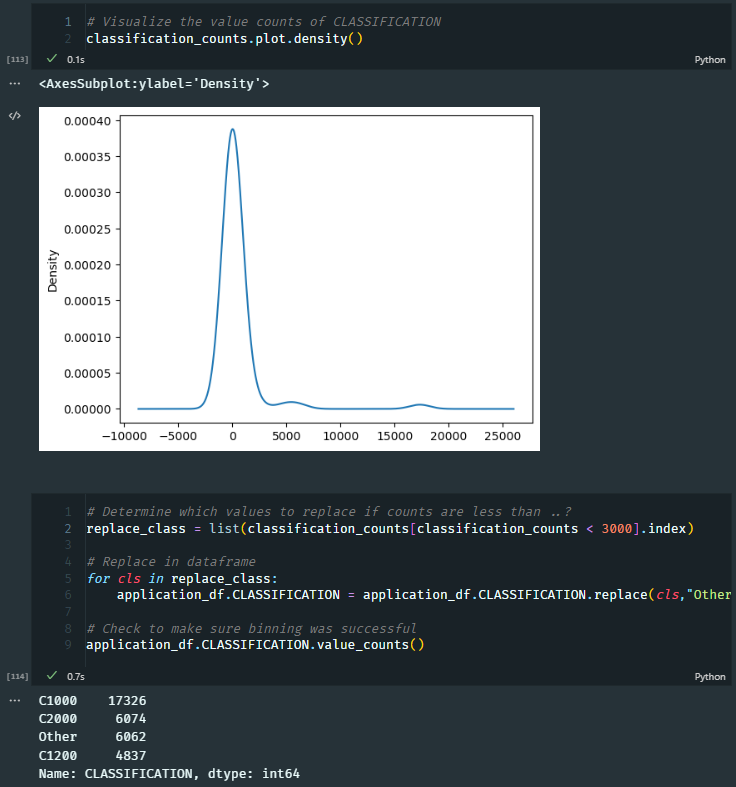
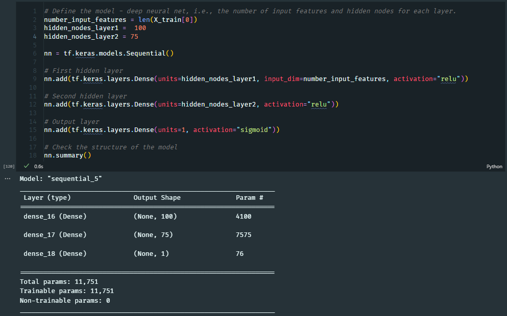
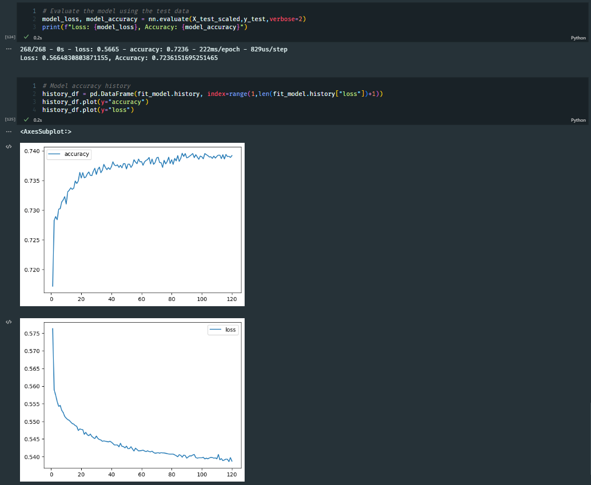

# Neural Network Charity Analysis

## Overview
The purpose of this analysis is to use machine learning and neural networks to create a binary classifier that is capable of predicting whether applicants will be successful if funded by Alphabet Soup. This was accomplished using SKLearn and TensorFlow.

## Results
### Data Preprocessing
The following steps were taken to preprocess the data for the neural network model:
- Target variable was identified as IS_SUCCESSFUL
- Features were identified as all columns except IS_SUCCESSFUL and EIN
- The following columns were removed from the features:
    - EIN
    - NAME

### Compiling, Training, and Evaluating the Model
The following steps were taken to compile, train, and evaluate the model:
- The neural network model was created using the following parameters:
    - 2 hidden layers
    - 80 nodes in the first hidden layer
    - 30 nodes in the second hidden layer
    - relu activation function
    - 100 epochs

- The target accuracy of 75% was not achieved, the final accuracy score was 72.3%. All of the following steps taken to improve the model resulted in accuracy scores within less than 1% of each other
- Steps taken to improve the model consisted of variations of the following:
    - Adding a third and fourth hidden layer
    - Increasing the number of nodes in the first and second hidden layers to 150 and 75 respectively
    - Changing the activation function to leaky_relu and elu
    - Changing the number of epochs to 120
    - Changing the number of applications and classification counts from 500 to 1000 and 2000 to 4000 respectively

## Summary
The accuracy of the model was 72.3%, meaning that the model was able to predict the success of the applicants 72.3% of the time. This model was not able to meet the target accuracy of 75%. As this is a binary classification problem, it is possible that with sufficient data, a supervised machine learning model could be created that would be able to predict the success of the applicants with greater accuracy. It is also possible that the numerical difference between different applicants income and ask, which range from thousands to millions, is too large even with the scaling of the data.